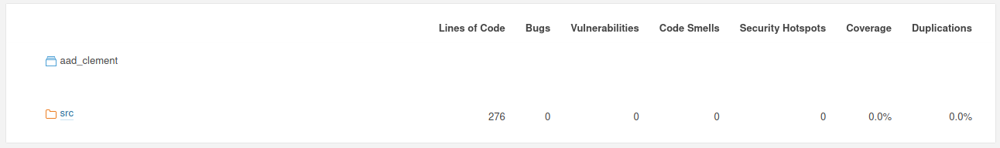

# Compilation

Du fait de nos environnements de travail différents (Clément travaillait sur un PC Windows alors que j'utilisais un système Linux), il n'avait pas besoin d'ajouter la librairie `limits.h`, il demandait la valeur `MAX_INT` et cela fonctionnait pour lui à la compilation mais pas pour moi.

# Correction des erreurs

Après avoir compilé, j'ai utilisé Valgrind pour pouvoir analysé les potentielles erreus et les fuites mémoires. Si il n'y avait pas de fuites mémoires, il y avait beaucoup d'erreurs.

```
==4926== 
==4926== HEAP SUMMARY:
==4926==     in use at exit: 0 bytes in 0 blocks
==4926==   total heap usage: 2 allocs, 2 frees, 4,103 bytes allocated
==4926== 
==4926== All heap blocks were freed -- no leaks are possible
==4926== 
==4926== Use --track-origins=yes to see where uninitialised values come from
==4926== For lists of detected and suppressed errors, rerun with: -s
==4926== ERROR SUMMARY: 2781100 errors from 145 contexts (suppressed: 0 from 0)
```

Je me suis vite rendu compte que ces erreurs étaient dûes à un mauvais `malloc`, que j'ai modifié :

``` C
# L'ancienne version du malloc :
long * numbers = (long *) malloc (n + 1);

# La nouvelle version du malloc :
long * numbers = (long *) malloc (sizeof(long) * n);
```

Après cette simple correction, il n'y avait ni d'erreurs ni de fuite de mémoire.

# Analyse du code avec SonarQube

Pour analyser le code de Clément, j'ai voulu utiliser SonarQube, qui est un outili qui permet, avec des métriques d'analyser la qualité d'un code. SonarQube propose plusieurs versions, une version communitaire, une version pour les développeurs et une version entreprise. Si la version communautaire est gratuite, elle ne permet pas d'analyser le C, et il faut se tourner vers une version payante. 

Heureusement, j'ai pu trouver un plugin open-source sur GitHub pour pouvoir analysé le code depuis SonarQube. Mettre tout en place pour pouvoir lancer une analyse m'a pris beaucoup de temps, et les résultats étaient quelque peu décevant :



J'ai modifié le code pour pouvoir ajouté un bug, mais celui-ci n'a pas été analysé par SonarQube, j'ai donc décidé d'abandonner l'idée d'utiliser SonarQube, ayant déjà passé beaucoup de temps dessus et n'ayant pas trouvé de résultats pertinents.

# Tests unitaires

Pour les tests unitaires, je choisi d'utiliser la biblithèque utilisée pour les TP de C de première année (teZZt) écrite M. Yon et M. Bachelet. Elle a l'avantage d'étre très légère et facile à intégrer, puisqu'elle est contenue dans un simple `.h`. Je récupère ce `.h` depuis le répertoire git d'un TP de C de ZZ1.

Le programme fut très compliqué à comprendre, il y a beaucoup de variables globales qui sont définies dans des endroits différents. Par exemple la fonction `calcul`, qui est la plus grosse fonction ne prenait qu'un seul argument, et lit toutes les autres informations à partir des variables. J'ai ajouté des paramètres à cette fonction pour pouvoir y voir plus clair mais il y a encore des variables à l'intérieur qui sont définies dans `compte.h` et modifiées dans la fonction, puis lues dans la fonction main.

Pour les premiers test je vais ajouter un calcul "impossible", à savoir trouver un résultat entier positif en lui donnant que des 0 pour calculer le nombre.
J'obtiens une erreur à l'exécution, peut-être à cause d'une division par zéro :

```
Floating point exception (core dumped)
```

Je me dis que les nombres doivent être forcément différents de zéro dans le compte est bon, je vais maintenant tester avec que des uns et un nombre à obtenir inatteignable avec ces uns.
Malheureusement là encore j'obtiens la même erreur.

Même en mettant un calcul possible, j'obtiens encore cette erreur. Il fallait initialiser des valeurs avant l'appel à la fonction.

Ensuite j'ai voulu vérifier que les calculs intermédiaires pour trouver une solution étaient corrects avec des nombres aléatoires, ce qui était correct d'après mes tests.

``` C
TEST(tester_calculs_intermediaires) {
    int i;
    int meilleurcalcul = 0;
    long meilleurecart = 0;
    long resultat = 678;
    termeini = (long *) malloc (6 * sizeof(long));
    for(i = 0; i < 6; i++)
        termeini[i] = genrand_int32_pos()%100;
    for(i=0;i<6;i++)  
        terme[6][i]=termeini[i];
    compte(6, resultat, &meilleurecart, &meilleurcalcul);
    for(i = 0; i < 6; i++) {
        switch(bestsolution.operation[i]) {
            case '/': 
                CHECK(bestsolution.valeur1[i] / bestsolution.valeur2[i] == bestsolution.resultat[i]);
                break;
            case '*':
                CHECK(bestsolution.valeur1[i] * bestsolution.valeur2[i] == bestsolution.resultat[i]);
                break;
            case '+':
                CHECK(bestsolution.valeur1[i] + bestsolution.valeur2[i] == bestsolution.resultat[i]);
                break;
            case '-':
                CHECK(bestsolution.valeur1[i] - bestsolution.valeur2[i] == bestsolution.resultat[i]);
                break;
        }
    }
    free(termeini);
}
```

Enfin, j'ai voulu répéter un test similaire mais en prenant des uns à la place de nombres générés aléatoirement, et je n'ai pas pu le faire puisqu'une variable globale n'est pas réinitialisée.